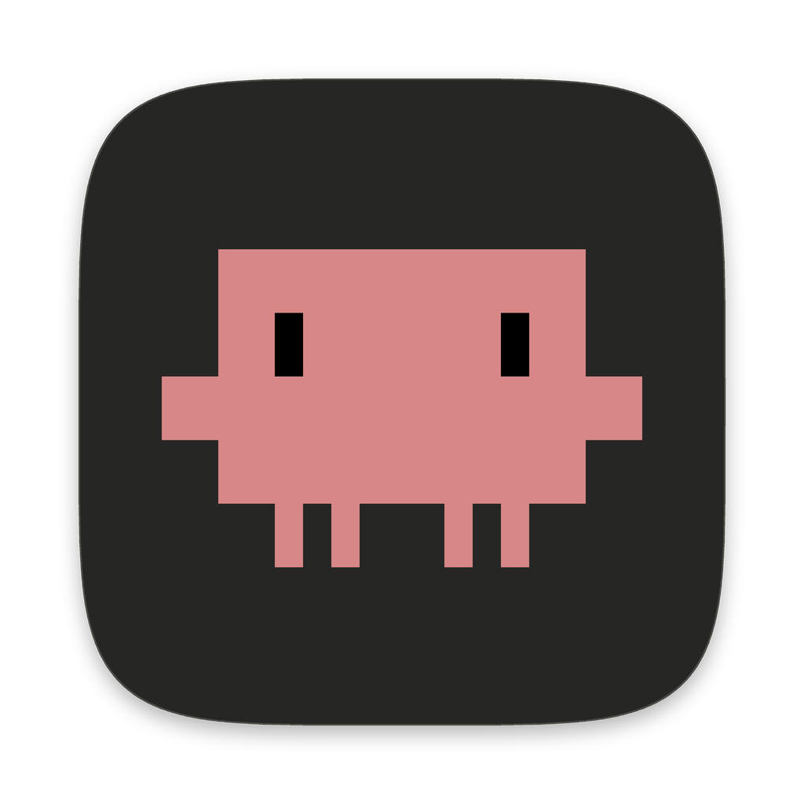
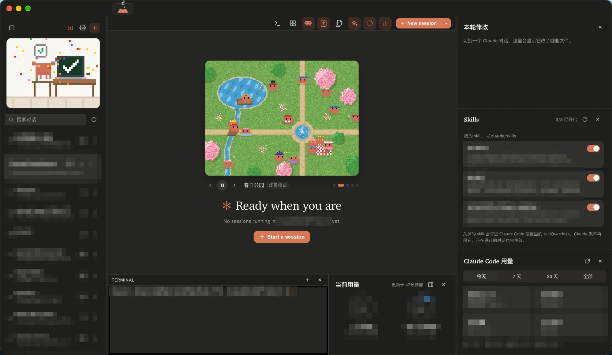
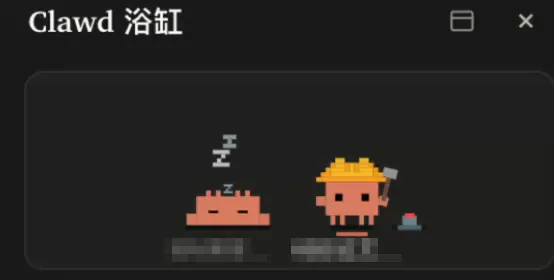
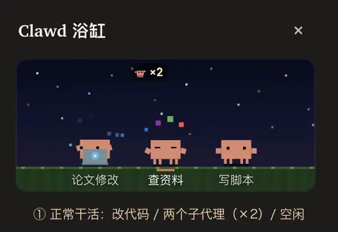
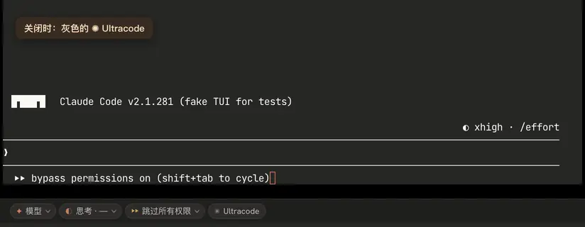
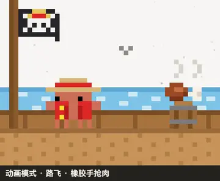
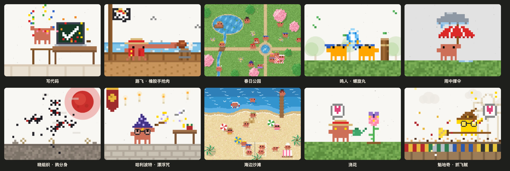

<p align="center">
  
</p>

<h1 align="center">Crabyard</h1>

<p align="center">
  一个给 Claude Code 用的桌面工作台，院子里住着一群像素小螃蟹。<br />
  A desktop workbench for Claude Code, with a yard full of pixel crabs.
</p>

> **非官方项目。** Crabyard 基于 [Vibeyard](https://github.com/elirantutia/vibeyard)（MIT）修改，和 Anthropic 没有关系。「Claude」和 Clawd 小螃蟹是 Anthropic 的商标。
>
> **Unofficial.** Crabyard is a modified version of [Vibeyard](https://github.com/elirantutia/vibeyard) (MIT) and is not affiliated with Anthropic. "Claude" and Clawd are trademarks of Anthropic.

<p align="center">
  
</p>

## 这是什么

Crabyard 把 Claude Code CLI 放进一个桌面窗口：

- **左边**：按文件夹整理好的全部 Claude Code 对话，点一下接着聊。
- **中间**：真正的 `claude` 终端，底部有模型、思考、权限模式、Ultracode 按钮。
- **右边**：这次对话改了哪些文件、Skills 和插件开关、当前用量和用量统计，还有一个 Clawd 浴缸——每个开着的对话是一只像素螃蟹，跟着 Claude 干活。

它**不替代** Claude Code：每个标签页里跑的就是你自己装好的 `claude`，登录、设置、skills、插件、历史对话都是你原来的那一套。Crabyard 只是在外面加了一层看得见、点得到的界面。

## 演示

<table>
  <tr>
    <td align="center" width="50%">
      <a href="docs/demo-clawd-tub.mp4"></a><br />
      <sub><b>Clawd 浴缸</b>：一个对话在睡觉，一个在「盖房子」（跑命令）</sub>
    </td>
    <td align="center" width="50%">
      <a href="docs/demo-knockout.mp4"></a><br />
      <sub><b>出错晕倒、点一下复活</b>：API 报错时螃蟹晕倒；进程异常退出后点一下重新打开对话</sub>
    </td>
  </tr>
  <tr>
    <td align="center" width="50%">
      <a href="docs/demo-ultracode.mp4"></a><br />
      <sub><b>Ultracode 按钮</b>：一点就发 <code>/effort ultracode</code>，亮起 Claude Code 同款彩虹字和流动边框</sub>
    </td>
    <td align="center" width="50%">
      <a href="docs/demo-characters.mp4"></a><br />
      <sub><b>角色动画</b>：路飞、鸣人、晓组织、哈利波特、魁地奇</sub>
    </td>
  </tr>
</table>

<sub>点动图可以看高清视频。浴缸演示里的对话名已打码；其余演示录自测试环境，Ultracode 演示里的 CLI 是测试用的模拟界面。</sub>

## 功能

### 对话

- **全部对话一目了然**：按文件夹列出 `~/.claude/projects` 里的所有 Claude Code 对话，点一下就用 `claude -r` 接着聊；不要的对话可以删（移到废纸篓）。
- **开箱即用的默认值**：新对话默认用 `bypassPermissions` 权限模式和 `xhigh` 思考强度；在 profile 的额外参数里写了 `--permission-mode` 或 `--effort` 就以你写的为准。
- **底部按钮**：模型、思考强度、权限模式一点就切。按钮替你把 `/model`、`/effort`、Shift+Tab 敲进 Claude，发送前会先读屏幕，确认输入框是空的、没有弹窗，不会误答权限确认，也不会冲掉你没发的草稿。
- **Ultracode 按钮**：一点开启 Claude Code 的 ultracode（xhigh 思考 + 动态多 agent 编排，只对当前对话有效），再点关闭。开启时按钮显示 Claude Code 同款的彩虹字、逐字扫光和流动彩虹边框。开不了的时候（没开 dynamic workflows、思考强度被限制、模型不支持 xhigh）直接告诉你原因。
- **git 改动随手看**：鼠标移到会话标签上，弹出分支和改动数量。
- **新建项目不用起名**：选文件夹就行，名字默认是文件夹名，之后右键可以改。

### Clawd 浴缸

- 每个开着的对话是一只像素螃蟹，动作跟着 Claude 正在用的工具变：改代码时打字、读代码时拿放大镜、跑命令时盖房子、等你确认时跳起来提醒、空闲久了睡觉。
- 背景是 clawd-tank 的夜空、星星和草地。
- **出错晕倒**：API 报错时螃蟹头上弹出「!」、眼睛变成 ×；切回这个对话或点它一下就醒过来。
- **异常退出**：`claude` 进程异常退出后，螃蟹倒在浴缸里不消失，点一下重新打开这个对话。
- **子代理**：Claude 派出子代理干活时，螃蟹旁边显示「小螃蟹 ×N」。
- **右键菜单**：打开或关闭这个对话。

### Clawd 动画

侧边栏顶部的卡片和空白项目页的播放器会轮流播放 10 个像素动画，按 [clawd-avatar-skill](https://github.com/YANZHANLIN/clawd-avatar-skill) 的规格画的：

- **动画模式 8 个**：写代码、雨中撑伞、浇花，以及 5 个角色——路飞（草帽 + 红马甲，橡胶手抢肉）、鸣人（护额，影分身搓螺旋丸）、晓组织（斗笠 + 红云斗篷，写轮眼、鸦分身）、哈利波特（巫师帽 + 圆眼镜 + 闪电疤，漂浮咒）、魁地奇（分院帽 + 眼镜，骑扫帚抓金色飞贼）。
- **场景模式 2 个**：春日公园、海边沙滩。

<p align="center">
  
</p>

### 右边栏

每块都能单独开关、拖动边缘调整高度：

- **本轮修改 / 本对话修改**：当前对话改了哪些文件（包括子代理改的），点开看 diff。
- **Skills**：开关你的 skills（`~/.claude/skills` 和项目的 `.claude/skills`，写入 Claude Code 设置里的 `skillOverrides`，正在进行的对话也会生效），以及已安装的插件（用 `claude plugin enable/disable`，新开的对话生效）。
- **当前用量**：5 小时和每周额度两个圆环，数据来自 Claude Code 的 statusLine；也可以停靠到底部终端旁边。
- **用量统计**：按天、模型、项目统计的费用和 token。

另外，上下文用量显示在 Claude Code 输入框下方；终端和「本对话修改」的开关在侧边栏顶部。

## 和直接用 Claude Code、和 Vibeyard 有什么区别

| | 直接在终端里用 Claude Code | Vibeyard（上游） | Crabyard |
|---|---|---|---|
| 历史对话 | `claude -r` 只列当前目录的对话 | 按项目管理它自己开的会话 | 全部 `~/.claude/projects` 对话按文件夹列出，一点接着聊，可以删 |
| 切模型、思考、权限模式 | 敲 `/model`、`/effort`、按 Shift+Tab | 没有 | 底部按钮一点就切，读屏幕确认安全后才发送 |
| Ultracode | 敲 `/effort ultracode` | 没有 | 专门的开关按钮，带 Claude Code 同款动画，开不了会说明原因 |
| 改了哪些文件 | 翻终端输出 | 项目文件树 | 本轮、本对话修改列表 + diff，包括子代理改的 |
| 用量 | `/usage`、自己配 statusLine | 每个会话的费用和上下文 | 5 小时、每周额度圆环 + 按天、模型、项目的统计 |
| Skills 和插件 | 手改 settings.json、敲 `claude plugin` | 没有 | 开关按钮 |
| 对话状态 | 终端里的文字 | 标签页上的彩色圆点 | 圆点 + Clawd 浴缸（晕倒、倒下、子代理都看得见） |
| 默认值 | 手动确认、默认思考强度 | 同 Claude Code | `bypassPermissions` + `xhigh` |
| 界面 | 终端 | 深色、浅色主题 | Claude 暖色主题 + 衬线字体，像素螃蟹和动画 |

**Crabyard 保留了 Vibeyard 的**：一个项目里开多个会话、Swarm 网格视图、多个 Claude 账号（profile）并排用、会话检查器、会话恢复、深色和浅色主题、把自己的会话分享给别人、Codex / Gemini / Copilot CLI 支持。

**Crabyard 去掉了 Vibeyard 的**：项目总览面板（AI Readiness 评分、看板、GitHub PR / Issue 等小组件）、看板、内嵌浏览器标签页、MCP 检查器、加入别人分享的会话。界面更简单，专心给 Claude Code 用。

## 安装（macOS）

需要 Node.js 18+ 和已经安装、登录好的 [Claude Code](https://docs.anthropic.com/en/docs/claude-code)。

```bash
npm install
npm run app
```

`npm run app` 会构建、用本地 ad-hoc 签名打包，并安装到 `/Applications/Crabyard.app`。开发时用 `npm run dev`，测试用 `npm test`。

## 致谢

- [Vibeyard](https://github.com/elirantutia/vibeyard) — Eliran Tutia 和[各位贡献者](https://github.com/elirantutia/vibeyard/graphs/contributors)，MIT。Crabyard 的底子：本仓库从 Vibeyard 0.3.8 的代码开始，原来的提交历史保留在原仓库里。
- [clawd-tank](https://github.com/marciogranzotto/clawd-tank) — Marcio Granzotto Rodrigues，MIT。浴缸里的螃蟹动画和夜空背景（`src/renderer/assets/clawd/`，附原许可证）。
- [clawd-avatar-skill](https://github.com/YANZHANLIN/clawd-avatar-skill) — YANZHANLIN。Clawd 动画的画法和规格（动画模式、场景模式、帽子、道具和角色预设）。
- Ultracode 按钮的动画参考了 [pi](https://github.com/earendil-works/pi) 的 rainbow-editor 示例（扫光节奏，MIT）和 [Magic UI](https://github.com/magicuidesign/magicui) 的 Rainbow Button（流动彩虹边框的写法，MIT），配色取自 Claude Code 自己的主题。只借鉴了做法，没有复制代码。

## English

Crabyard wraps the Claude Code CLI in a desktop window. Every tab runs your own `claude`, with your login, settings, skills and plugins. Around it you get:

- all your Claude Code conversations, grouped by folder, resumable in one click;
- one-click model, effort, permission-mode and Ultracode switches under each session;
- the files each conversation changed, with diffs;
- Skills and plugin switches;
- 5-hour and weekly usage rings, plus cost stats;
- a tub of pixel crabs that act out what each session is doing — they get knocked out on API errors and show subagents at work;
- ten pixel animations, including five character pieces.

Compared with Vibeyard, it drops the project dashboard, kanban, embedded browser, MCP inspector and joining shared sessions, and adds the Claude-specific tools above.

## 许可

MIT，见 [LICENSE](LICENSE)。
