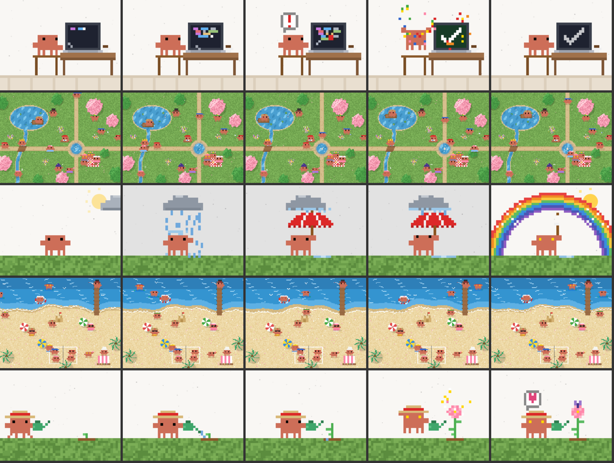

<p align="center">
  
</p>

<h1 align="center">Crabyard</h1>

<p align="center">
  一个给 Claude Code 用的桌面工作台，院子里住着一群像素小螃蟹。<br />
  A desktop workbench for Claude Code, with a yard full of pixel crabs.
</p>

> **非官方项目。** Crabyard 基于 [Vibeyard](https://github.com/elirantutia/vibeyard)（MIT）修改，和 Anthropic 没有关系。「Claude」和 Clawd 小螃蟹是 Anthropic 的商标。
>
> **Unofficial.** Crabyard is a modified version of [Vibeyard](https://github.com/elirantutia/vibeyard) (MIT) and is not affiliated with Anthropic. "Claude" and Clawd are trademarks of Anthropic.

<p align="center">
  
</p>

## 功能

- **对话侧栏**：按文件夹列出 `~/.claude/projects` 里的所有 Claude Code 对话，点一下就用 `claude -r` 接着聊；也能删除对话（移到废纸篓）。
- **Clawd 浴缸**：每个开着的对话是一只像素螃蟹，动作跟着 Claude 正在用的工具变——改代码时打字、读代码时拿放大镜、跑命令时盖房子、等你确认时跳起来提醒。放在标签页上方的标题栏里，或者右边栏。
- **Clawd 动画**：侧边栏卡片和空白页播放器里的 5 个像素动画。动画模式 3 个（写代码、雨中撑伞、浇花），场景模式 2 个（春日公园、海边沙滩）。
- **右边栏**，每块都能单独开关、拖动调整高度：
  - 本轮修改 / 本对话修改：当前对话改了哪些文件，点开看 diff
  - Skills：开关 Claude Code 的 skill（写入设置里的 `skillOverrides`）
  - 当前用量：5 小时和每周额度的圆环，也可以停靠到终端旁边
  - 用量统计：按天、模型、项目统计的费用和 token
- **上下文用量**：显示在 Claude Code 输入框下方。
- 每个对话底部可以快速切换模型、思考和权限模式。

<p align="center">
  <br />
  <sub>5 个 Clawd 动画：写代码、春日公园、雨中撑伞、海边沙滩、浇花</sub>
</p>

## 安装（macOS）

需要 Node.js 18+ 和已经安装好的 [Claude Code](https://docs.anthropic.com/en/docs/claude-code)。

```bash
npm install
npm run app
```

`npm run app` 会构建、用本地 ad-hoc 签名打包，并安装到 `/Applications/Crabyard.app`。开发时用 `npm run dev`，测试用 `npm test`。

## 致谢

- [Vibeyard](https://github.com/elirantutia/vibeyard) — Eliran Tutia 和[各位贡献者](https://github.com/elirantutia/vibeyard/graphs/contributors)，MIT。Crabyard 的底子：本仓库从 Vibeyard 0.3.8 的代码开始，原来的提交历史保留在原仓库里。
- [clawd-tank](https://github.com/marciogranzotto/clawd-tank) — Marcio Granzotto Rodrigues，MIT。浴缸里的螃蟹动画（`src/renderer/assets/clawd/`，附原许可证）。
- [clawd-avatar-skill](https://github.com/YANZHANLIN/clawd-avatar-skill) — YANZHANLIN。Clawd 动画的画法和规格（动画模式、场景模式、帽子）。

## 许可

MIT，见 [LICENSE](LICENSE)。
